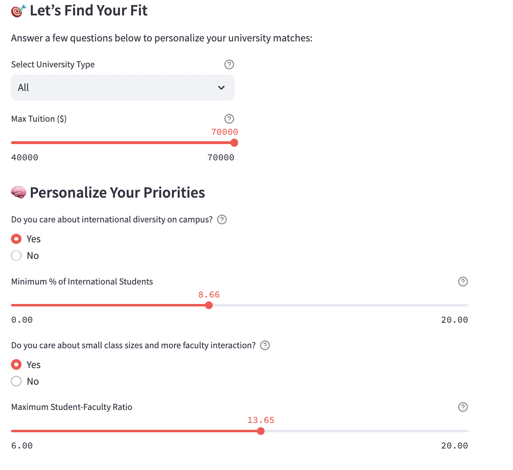
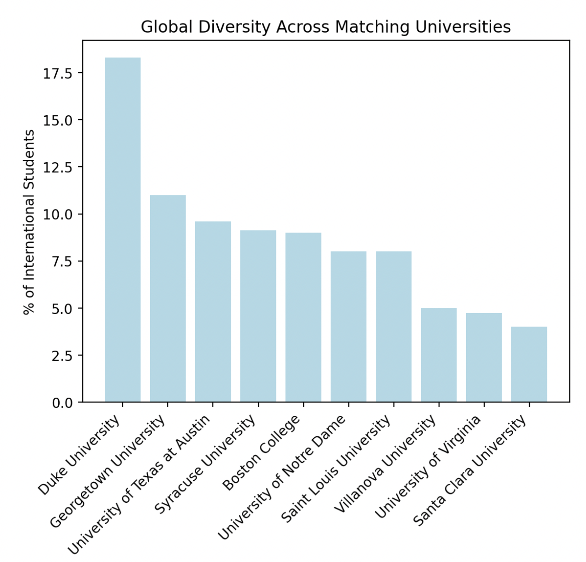
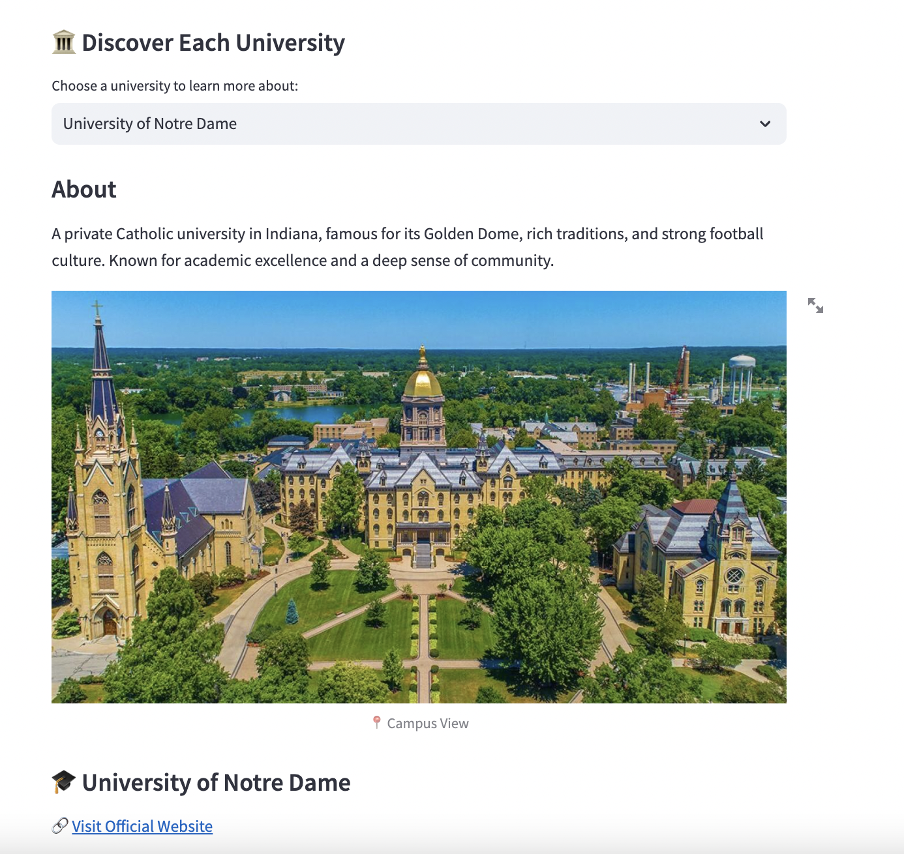

# University Explorer - Discovering Universities

## Introduction
* As a student at the University of Notre Dame, I was inspired to create this project after reflecting on the qualities that make this campus feel like home: **community**, **purpose**, **academic excellence**, and a **sense of mission**. Wanting to find schools that reflect similar values, I conducted my own research and compiled a dataset of 10 standout universities. I gathered data from many different of sources and cleaned the results to create a small but informational file. 
* For many students, choosing between such great options can feel overwhelming, and that is where this app comes in. Anyone can use it and take advantage of it, but it can be most helpful to highschool students in the process of applying to Universities. This University Explorer helps users visualize and compare schools across meaningful dimensions, and even offers personalized advice depending on their stage in the application journey.

# Project Overview
University Explorer is an interactive Streamlit app that helps prospective students:
- Filter and discover universities that match users’ values and priorities
- Dive deeper into profiles of 10 institutions
- Visualize key metrics like tuition, student-faculty ratio, and diversity
- Access college application advice based on unique profile
- The app supports two distinct use cases:
- **Help Me Decide Where to Apply** — for users looking for guidance in narrowing down their     options.
- **Learn More About Each One** — for users who want to compare and explore schools in greater   depth.

# How to Run the App
## Requirements
To run the app locally, make sure your requirements.txt file includes the necessary packages, generated using pipreqs. Common dependencies include:

- streamlit==1.33.0
- pandas
- matplotlib

## Instructions
1) Open a terminal.
2) Navigate to the directory where app.py is located:
3) cd FinalStreamlitApp
4) Start the app:
   - streamlit run app.py
5) The app will automatically launch in your default web browser.

   
[Access the Live App](https://cohen-pythonportfolio-mwojbbcv7agaf6b7yumbhh.streamlit.app/)  

# App Features
## Option 1: Help Me Decide Where to Apply
Deciding which university to apply to can be one of the most important and stressful choices for a student. This part of the app allows users to customize key preferences that may strongly influence their decision-making process:
Public vs. Private universities
Tuition budget limits
Minimum % of international students (for global exposure)
Maximum student-faculty ratio (for class size and faculty access)
These parameters allow users to focus on what matters most to them. By setting filters, users receive a personalized list of university matches, updated in real-time. The filtering options are shown below: 

Once preferences are set, the app provides matching results in a clean, easy-to-read table, and also generates visuals to help interpret the data:
- Histogram of tuition distribution
- Pie chart comparing public vs. private schools
Bar chart showing global diversity based on the percentage of international students (shown - below.

## Option 2: Learn More About Each One
For users who already have an idea of where they might want to apply, this option offers an in-depth look at each university. Users can select a school from a dropdown list and view:
- A photo of the campus
- A  description of the university
- 3 fun facts unique to the school
- A list of the most popular majors offered

A preview of this is seen below: 
 
 
This section is perfect for side-by-side comparisons or simply exploring schools that students might not have known about.

# Personalized Application Advice
A special feature that sets this app apart is the final expander: college advice tailored to your grade level in high school. 
Users select whether they are a:
- Freshman/Sophomore
- Junior
- Senior
  
Based on their response, the app provides tips and action items appropriate for their stage in the application process. From building a strong GPA to asking for recommendation letters early, the guidance is practical and easy to follow.

# References & Resources
[U.S. News & World Report](https://www.usnews.com/best-colleges),  
[College Factual](https://www.collegefactual.com/),  
[College Raptor](https://www.collegeraptor.com/),  
[University of Notre Dame](https://www.nd.edu/),  
[Boston College](https://www.bc.edu/),  
[Villanova University](https://www1.villanova.edu/),  
[Georgetown University](https://www.georgetown.edu/),  
[Saint Louis University](https://www.slu.edu/),  
[Santa Clara University](https://www.scu.edu/),  
[University of Texas at Austin](https://www.utexas.edu/),  
[Duke University](https://www.duke.edu/),  
[University of Virginia](https://www.virginia.edu/),  
[Syracuse University](https://www.syracuse.edu/)

# Final Thoughts
University Explorer is more than just a tool, but an experience for any student. I hope it brings students one step closer to finding a university that feels like home.
